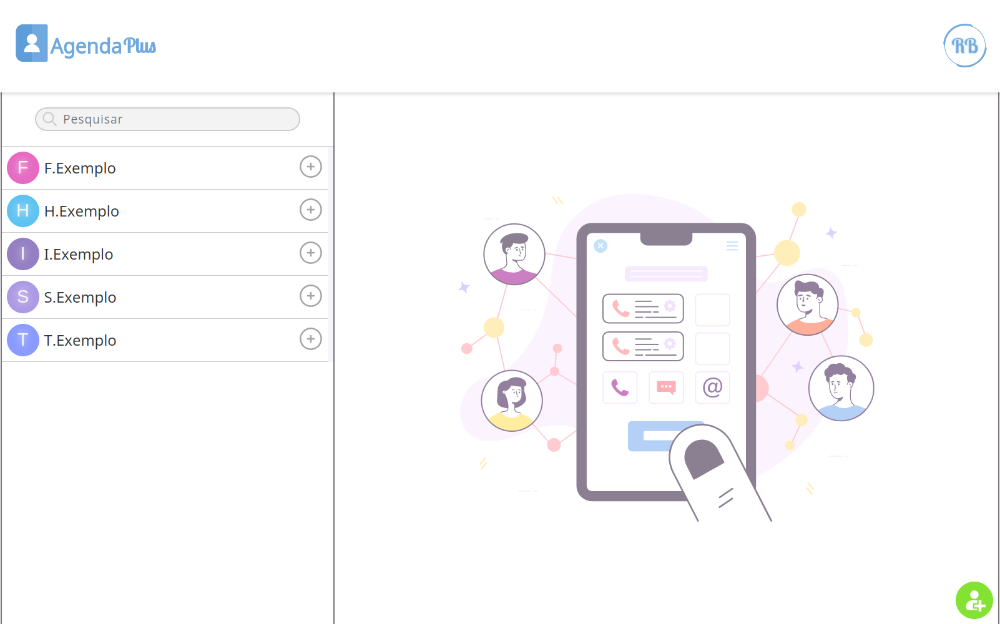

# Agenda Plus
Agenda Plus é uma aplicação web para gerenciamento de contatos, oferecendo recursos como visualização, adição, edição e remoção de contatos. A aplicação também permite exibir detalhes de cada contato selecionado, listar contatos em ordem alfabética, realizar buscas rápidas por meio de um campo de pesquisa e é totalmente responsiva para dispositivos móveis.
A estrutura do projeto foi desenvolvida com React e TypeScript. Para garantir melhor performance, utilizei o Vite como bundler e o Redux para gerenciar o estado da aplicação. As animações foram implementadas no formato Lottie JSON, integradas por meio da biblioteca Lottie React.
 
 

## Tecnologias Utilizadas

&nbsp;
&nbsp;
&nbsp;
&nbsp;
&nbsp;
&nbsp;
 
 

## Link Demo: [Next Finance](https://project-next-finance.vercel.app/)

  

